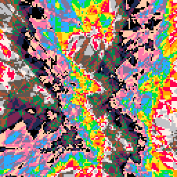
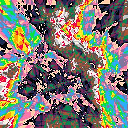
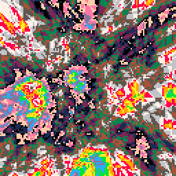

# Binary Map Generator

Created Approx 8th Feb 2019

A simple map generation algorithm based upon generating random lines, on one side of which will increment the land height by 1.
The generation process works directly off the pixel buffer for rendering, so the calculation process is visualised.

When several iterations are complete, the minimum and maximum heights generated are remapped to different colours, to give the appearance of water, beaches, and lucious green tropical islands.

